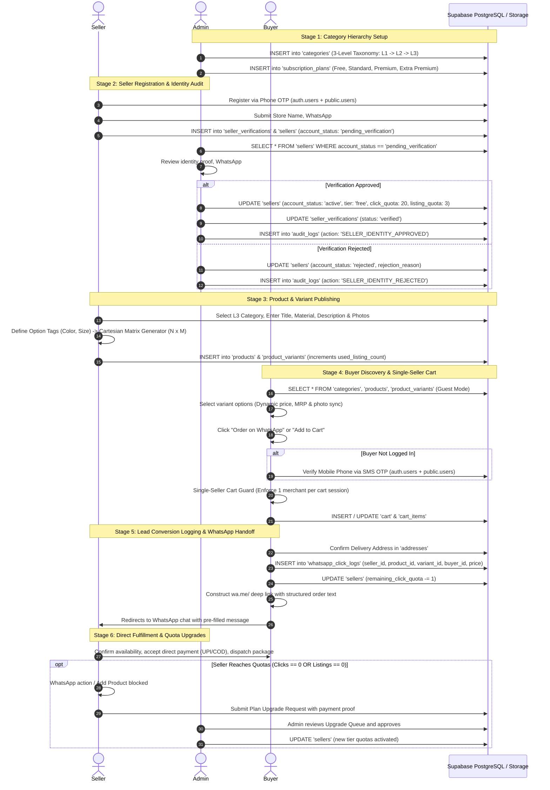
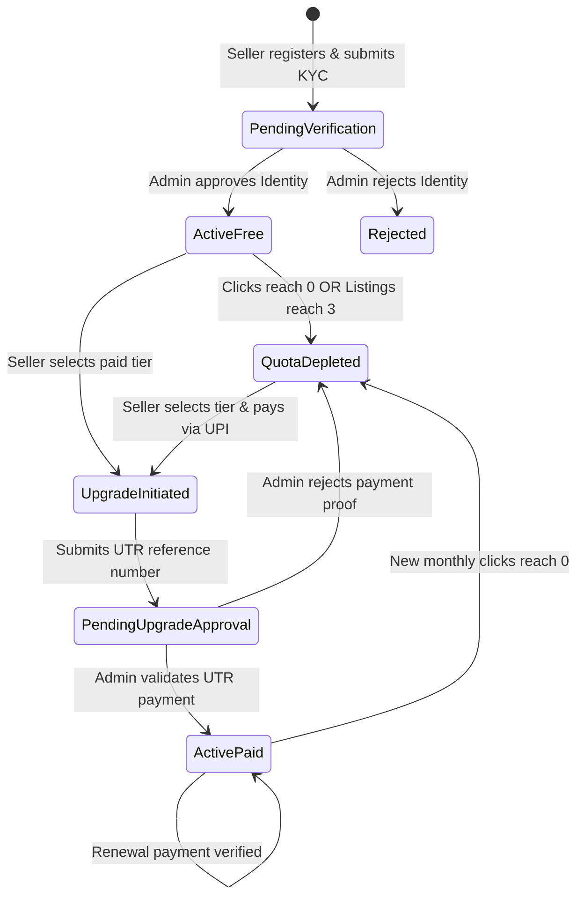
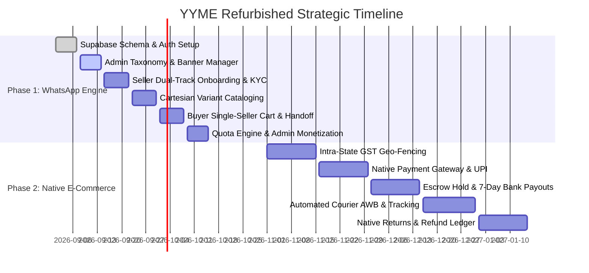

# YYME Platform — Refurbished Architectural Blueprint & Implementation Plan

> **Phase 1 Release Target**: Direct-to-Merchant WhatsApp Order Engine, Single-Seller Cart, Tiered Monetization, and Simplified Cataloging for `yyme-1`.

---

## 1. Executive Summary & Paradigm Shift

The **YYME** platform is undergoing a strategic refurbishment to transition from a complex, friction-heavy payment-gateway and escrow-settlement system to an agile, conversion-focused **WhatsApp-Direct Order Engine (Phase 1)**. 

In this refurbished model, buyers discover unique artisanal and commercial products nationwide, configure their preferred variants, and trigger structured order messages directly to the merchant's registered WhatsApp. Platform monetization shifts from complex escrow commissions to a **Tiered Lead-Generation & Listing Subscription Model** powered by granular click analytics.

```
┌────────────────────────────────────────────────────────────────────────────────────────┐
│                                 PHASE 1 CORE ENGINE                                    │
│                                                                                        │
│   BUYER DISCOVERY  ──►  OTP AUTH  ──►  SINGLE-SELLER CART  ──►  CLICK LOGGING  ──►  WHATSAPP DEEP-LINK
│    (Guest Mode)         (SMS OTP)      (1 Merchant Limit)      (Lead Audit)        (Direct Chat)
└────────────────────────────────────────────────────────────────────────────────────────┘
```

### 1.1 "Now vs. Refurbished" Architectural Comparison

| Dimension | Current Implementation (`yyme`) | Refurbished Implementation (`yyme-1`) |
|---|---|---|
| **Ordering Model** | In-app checkout with mock payment gateway & transaction simulation | **Direct WhatsApp Order Handoff** (`wa.me` deep-link with pre-filled order payload) |
| **Cart Architecture** | Multi-seller cart (complex multi-order splitting at checkout) | **Single-Seller Cart Policy** (Restricts cart to 1 merchant for clean chat handoff) |
| **Financial Settlement** | Escrow holding, 7-day bank release, commission deductions, 1% TCS | **Offline / Direct Settlement** (Buyer pays seller directly via UPI, COD, or Bank Transfer) |
| **Platform Monetization** | Commission % + 18% service tax deducted from escrow payout | **Tiered Subscription & Pay-Per-Lead Model** (Tracked via `whatsapp_click_logs`) |
| **Logistics & Delivery** | 2D dynamic distance/weight matrix, Haversine GPS calculations | **Direct Arrangement** (Buyer & seller negotiate local delivery or courier in WhatsApp) |
| **Quality Control** | Mandatory Admin QC gate (`pending_qc` $\rightarrow$ `published`) | **Immediate Publishing** upon seller active status; Admin regulates through Seller Verification |
| **Catalog Visibility** | Geo-filtered & state-limited logic | **Unrestricted National Visibility** in Guest Mode (Zero login required to browse) |
| **Seller Onboarding** | Mandatory bank verification & payout account linking | **Store Profile, WhatsApp Business Number & KYC Identity Proof** |
| **Seller Quotas** | Unlimited listings once active | **Tiered Quotas**: WhatsApp click ceiling + product listing limit with in-app upgrade flow |

---

## 2. Complete System Sequence Diagram



---

## 3. Detailed Architectural Specifications by Portal

### 3.1 Buyer Portal (`apps/buyer`)

The buyer application prioritizes instant discovery, seamless mobile authentication, and zero-friction order placement.

```
apps/buyer/
├── src/
│   ├── layouts/
│   │   └── BuyerLayout.tsx          # Clean navbar, search bar, active cart indicator
│   ├── core/
│   │   ├── contexts/
│   │   │   ├── AuthContext.tsx      # Buyer session & profile
│   │   │   └── CartContext.tsx      # Single-seller cart logic + localStorage sync
│   │   └── hooks/
│   │       ├── useProducts.ts       # National catalog querying
│   │       └── useCategories.ts     # 3-tier taxonomy cache
│   └── pages/
│       ├── home/Home.tsx            # Banners, category grid, top trending items
│       ├── auth/
│       │   ├── LoginModal.tsx       # Lightweight bottom-sheet OTP modal
│       │   └── OtpVerify.tsx        # 6-digit SMS verification
│       ├── discovery/
│       │   ├── ProductDetail.tsx    # Dynamic variant pill selector & price sync
│       │   ├── CategoryListing.tsx  # L1 -> L2 -> L3 drill-down filter
│       │   └── SearchResults.tsx    # Keyword search with debounced filtering
│       ├── cart/
│       │   └── Cart.tsx             # Single-seller enforcement & cart summary
│       └── checkout/
│           └── WhatsAppHandoff.tsx  # Address entry, click logger, and wa.me redirect
```

#### Key Buyer Mechanics & Functions:

1. **Guest Browsing by Default**:
   - Zero login required to view products, search, or filter variants.
   - Catalog queries query `public.products` joined with `public.product_variants` and `public.categories`.

2. **Interactive Cartesian Variant Selection (`ProductDetail.tsx`)**:
   - Attribute pills grouped by type (e.g., *Color*: Red, Blue; *Size*: S, M, XL).
   - Clicking an attribute combination updates the active variant in state, seamlessly synchronizing:
     - `selling_price` and `mrp`
     - Percentage discount badge (`Math.round(((mrp - price) / mrp) * 100)% OFF`)
     - Image gallery carousel to matching variant photos
     - Available stock status (`In Stock` vs `Out of Stock`)

3. **Single-Seller Cart Policy (`CartContext.tsx`)**:
   - State: `cart: CartItem[]`, `cartSellerId: string | null`, `cartTotal: number`.
   - Function `addToCart(item)`:
     ```typescript
     if (cartSellerId && cartSellerId !== item.sellerId) {
       // Prompt modal: "Your cart contains items from [Store A]. Clear cart to add from [Store B]?"
       return { requiresConfirmation: true, existingSeller: cartSellerName };
     }
     // Proceed to insert into cart
     ```

4. **WhatsApp Handoff & Click Logging (`WhatsAppHandoff.tsx`)**:
   - Pre-redirect mutation to `public.whatsapp_click_logs`:
     ```typescript
     await supabase.from('whatsapp_click_logs').insert({
       seller_id: item.sellerId,
       product_id: item.productId,
       variant_id: item.variantId,
       buyer_id: session?.user?.id || null,
       buyer_phone: buyerPhone,
       buyer_pincode: deliveryAddress.pincode,
       item_price: item.price,
       clicked_at: new Date().toISOString()
     });
     ```
   - Automatically decrements the seller's active click quota.

---

### 3.2 Seller Portal (`apps/seller`)

The seller application manages merchant onboarding, KYC identity verification, cataloging with option-tag variant generators, quota tracking, and subscription plan upgrades.

```
apps/seller/
├── src/
│   ├── core/
│   │   ├── contexts/
│   │   │   ├── SellerAuthContext.tsx  # Session, seller profile, active tier
│   │   │   └── QuotaContext.tsx       # Live remaining clicks & listing counts
│   │   └── hooks/
│   │       └── useCartesianMatrix.ts  # Generates N x M variant matrix
│   └── pages/
│       ├── onboarding/
│       │   ├── PhoneEntry.tsx         # Mobile OTP registration
│       │   ├── SellerTypeFork.tsx     # GST vs Non-GST Enrolment ID fork
│       │   ├── VerificationUpload.tsx # GSTIN / Enrolment ID / Disability proof
│       │   ├── StoreProfile.tsx       # Store name, WhatsApp business #, warehouse
│       │   └── ApprovalPending.tsx    # Verification status polling screen
│       ├── dashboard/
│       │   ├── DashboardHome.tsx      # Quota gauges (Clicks left, Products left), Lead counts
│       │   └── AnalyticsTab.tsx       # WhatsApp leads by product and pincode
│       ├── product/
│       │   ├── ProductListPage.tsx    # Product cards with stock & active status
│       │   └── ProductAddPage.tsx     # Cartesian variant matrix generator + bulk edit
│       └── subscription/
│           ├── UpgradeModal.tsx       # Subscription tier cards & feature comparison
│           └── PaymentProofSubmit.tsx # UPI QR code, UTR reference input, receipt upload
```

#### Key Seller Mechanics & Functions:

1. **Dual-Track KYC Registration**:
   - **Track A (GST Merchant)**: Enters 15-character GSTIN $\rightarrow$ Validates via GST API $\rightarrow$ Sets `is_gst_registered = true`.
   - **Track B (Non-GST Artisan/Home Seller)**: Enters PAN, Legal Name, Address $\rightarrow$ Generates 15-digit GST Enrolment ID in-app $\rightarrow$ Sets `is_gst_registered = false`.
   - **Optional Disability Proof**: Certified artisans upload proof $\rightarrow$ Triggers Admin review for permanent exemption.

2. **Cartesian Option-Tag Variant Generator (`useCartesianMatrix.ts`)**:
   - Seller defines dynamic option keys: `['Color', 'Size']`.
   - Seller types comma-separated tags: `Color: ['Blue', 'Green']`, `Size: ['M', 'L', 'XL']`.
   - Engine generates $2 \times 3 = 6$ variant rows automatically:
     - `Blue / M`, `Blue / L`, `Blue / XL`, `Green / M`, `Green / L`, `Green / XL`
   - **Bulk Edit Bar**: Apply universal MRP, Selling Price, and Stock quantity across all combinations with one click, with optional row-level overrides.

3. **Quota Enforcement & Upgrade Engine (`QuotaContext.tsx`)**:
   - If `remaining_click_quota <= 0`, buyer-facing WhatsApp order button displays "Seller is currently reviewing inquiries" or prompts seller to upgrade.
   - If `used_listing_count >= max_listing_quota`, "Add Product" button is disabled and opens `UpgradeModal.tsx`.
   - Seller selects a plan $\rightarrow$ Transfers fee via UPI QR $\rightarrow$ Submits UTR number $\rightarrow$ Moves account to `pending_upgrade_approval`.

---

### 3.3 Admin Portal (`apps/admin`)

The admin application provides high-altitude platform governance, identity approvals, upgrade verification, taxonomy management, and lead monetization intelligence.

```
apps/admin/
├── src/
│   ├── layouts/
│   │   └── AdminSidebar.tsx
│   └── pages/
│       ├── dashboard/
│       │   └── LeadAnalyticsPage.tsx     # Platform-wide WhatsApp lead metrics & top sellers
│       ├── verifications/
│       │   └── SellerIdentityQueue.tsx   # Queue 1: One-time KYC audit for new sellers
│       ├── subscriptions/
│       │   └── UpgradeRequestsQueue.tsx  # Queue 2: Recurring plan upgrades & UTR validation
│       ├── categories/
│       │   └── CategoryHierarchyPage.tsx # 3-level taxonomy editor (L1 -> L2 -> L3)
│       └── promotions/
│           └── BannerManager.tsx         # Home carousel slides & deep-links
```

#### Key Admin Mechanics & Functions:

1. **Queue Separation (Identity vs. Upgrades)**:
   - **Queue 1 (`SellerIdentityQueue.tsx`)**: Handles initial registration. Admin inspects store name, WhatsApp number, and identity proof.
     - *On Approve*: Activates seller account, sets tier to `free` (20 clicks, 3 listings).
     - *Disability Exception*: If disability certificate is verified, sets `is_disability_exempt = true` (Unlimited clicks & listings forever).
   - **Queue 2 (`UpgradeRequestsQueue.tsx`)**: Handles monetization. Admin inspects UTR number / bank slip for Standard (₹499), Premium (₹1,499), or Extra Premium (₹2,999).
     - *On Approve*: Resets and boosts `click_quota` and `listing_quota`; updates `current_period_end = now() + 30 days`.

2. **Lead Monetization & Analytics Dashboard (`LeadAnalyticsPage.tsx`)**:
   - Aggregates live mutations from `public.whatsapp_click_logs`:
     - Total leads generated across the platform (Day, Week, Month)
     - Top-performing merchants ranked by inquiries
     - Most clicked product categories and variants
     - High-intent buyer delivery pincodes (for geographic marketing)

---

## 4. Pre-Filled WhatsApp Message Specification

When a buyer clicks **"Order via WhatsApp"**, the application encodes and launches a direct WhatsApp URI:

$$\text{URI} = \text{\texttt{https://wa.me/91}} + \text{SellerWhatsAppNumber} + \text{\texttt{?text=}} + \text{encodeURIComponent}(\text{Payload})$$

### 4.1 Message Template Structure

```text
Hi [Store Name]! I want to place an order on yymee:

🛍️ *Product:* [Product Name]
🎨 *Variant:* [Variant Attributes, e.g. Color: Navy Blue / Size: XL]
💰 *Price:* ₹[Selling Price] (MRP: ₹[MRP])
📦 *Quantity:* [Quantity, e.g. 1]
📍 *Delivery Address:* [Address Line 1], [City], [State] - [PIN Code]

Please confirm availability and payment details.
```

### 4.2 Raw Payload Example

```
Hi Heritage Handlooms! I want to place an order on yymee:

🛍️ *Product:* Pure Handspun Chanderi Silk Saree
🎨 *Variant:* Color: Peacock Green / Zari: Gold
💰 *Price:* ₹2,499 (MRP: ₹3,899)
📦 *Quantity:* 1
📍 *Delivery Address:* Flat 402, Green Valley Apartments, Paroppadi, Kozhikode, Kerala - 673009

Please confirm availability and payment details.
```

---

## 5. Monetization Model: Tiered Quotas & Pricing

| Subscription Tier | WhatsApp Clicks / Month | Product Listings Limit | Monthly Fee | Activation Trigger |
|---|---|---|---|---|
| **Free** | **20 clicks** | **3 products** | **₹0** | Automatic upon Admin Identity Verification approval |
| **Standard** | **100 clicks** | **10 products** | **₹499** | Admin approves UTR payment proof |
| **Premium** | **500 clicks** | **50 products** | **₹1,499** | Admin approves UTR payment proof |
| **Extra Premium** | **2,000 clicks** (or Unlimited) | **200 products** | **₹2,999** | Admin approves UTR payment proof |
| **Artisan Exemption** | **Unlimited** | **Unlimited** | **₹0** (Free) | Granted to sellers with verified disability proof |

### 5.1 Quota Lifecycle State Machine



---

## 6. Clean Database Schema for the New Supabase DB

Below is the complete, clean schema DDL designed specifically for `yyme-1` in Phase 1:

```sql
-- ============================================================================
-- YYME-1 PHASE 1 DATABASE SCHEMA
-- ============================================================================

-- 1. USERS & IDENTITY
CREATE TABLE public.users (
  user_id uuid PRIMARY KEY DEFAULT gen_random_uuid(),
  phone_number varchar NOT NULL UNIQUE,
  email varchar,
  user_type varchar NOT NULL CHECK (user_type IN ('admin', 'buyer', 'seller')),
  is_active boolean NOT NULL DEFAULT true,
  created_at timestamptz NOT NULL DEFAULT CURRENT_TIMESTAMP,
  last_login_at timestamptz
);

-- 2. BUYERS PROFILE
CREATE TABLE public.buyers (
  buyer_id uuid PRIMARY KEY DEFAULT gen_random_uuid(),
  user_id uuid NOT NULL UNIQUE REFERENCES public.users(user_id) ON DELETE CASCADE,
  full_name varchar NOT NULL,
  default_address_id uuid,
  created_at timestamptz NOT NULL DEFAULT CURRENT_TIMESTAMP
);

-- 3. SELLERS PROFILE & QUOTA ENGINE
CREATE TABLE public.sellers (
  seller_id uuid PRIMARY KEY DEFAULT gen_random_uuid(),
  user_id uuid NOT NULL UNIQUE REFERENCES public.users(user_id) ON DELETE CASCADE,
  business_name varchar NOT NULL,
  owner_name varchar NOT NULL,
  whatsapp_number varchar NOT NULL,
  seller_type varchar NOT NULL DEFAULT 'standard',
  account_status varchar NOT NULL DEFAULT 'pending_verification' 
    CHECK (account_status IN ('pending_verification', 'active', 'rejected', 'frozen', 'suspended')),
  is_gst_registered boolean NOT NULL DEFAULT false,
  shipping_state varchar NOT NULL,
  
  -- Subscription & Quotas
  subscription_tier varchar NOT NULL DEFAULT 'free' 
    CHECK (subscription_tier IN ('free', 'standard', 'premium', 'extra_premium')),
  is_disability_exempt boolean NOT NULL DEFAULT false,
  click_quota integer NOT NULL DEFAULT 20,
  remaining_click_quota integer NOT NULL DEFAULT 20,
  max_listing_quota integer NOT NULL DEFAULT 3,
  used_listing_count integer NOT NULL DEFAULT 0,
  tier_expires_at timestamptz,
  
  -- Rejection remarks
  rejection_reason text,
  created_at timestamptz NOT NULL DEFAULT CURRENT_TIMESTAMP,
  updated_at timestamptz NOT NULL DEFAULT CURRENT_TIMESTAMP
);

-- 4. SELLER VERIFICATIONS (KYC & IDENTITY PROOFS)
CREATE TABLE public.seller_verifications (
  record_id uuid PRIMARY KEY DEFAULT gen_random_uuid(),
  seller_id uuid NOT NULL REFERENCES public.sellers(seller_id) ON DELETE CASCADE,
  verification_type varchar NOT NULL CHECK (verification_type IN ('GST', 'ENROLLMENT_ID', 'DISABILITY_PROOF')),
  reference_number varchar NOT NULL,
  document_url text,
  status varchar NOT NULL DEFAULT 'pending' CHECK (status IN ('pending', 'verified', 'rejected')),
  verified_on timestamptz,
  rejection_reason text,
  created_at timestamptz NOT NULL DEFAULT CURRENT_TIMESTAMP
);

-- 5. SUBSCRIPTION PLANS MASTER
CREATE TABLE public.subscription_plans (
  plan_id varchar PRIMARY KEY,
  name varchar NOT NULL,
  monthly_price numeric NOT NULL DEFAULT 0.00,
  click_quota integer NOT NULL,
  listing_quota integer NOT NULL,
  description text
);

INSERT INTO public.subscription_plans (plan_id, name, monthly_price, click_quota, listing_quota, description) VALUES
('free', 'Free Tier', 0.00, 20, 3, 'Kickstarter tier granted on KYC approval'),
('standard', 'Standard Tier', 499.00, 100, 10, 'For growing home-based merchants'),
('premium', 'Premium Tier', 1499.00, 500, 50, 'For high-volume artisans and stores'),
('extra_premium', 'Extra Premium Tier', 2999.00, 2000, 200, 'Unlimited growth for large enterprises');

-- 6. SUBSCRIPTION UPGRADE REQUESTS (PAYMENT PROOFS)
CREATE TABLE public.subscription_upgrade_requests (
  request_id uuid PRIMARY KEY DEFAULT gen_random_uuid(),
  seller_id uuid NOT NULL REFERENCES public.sellers(seller_id) ON DELETE CASCADE,
  target_plan_id varchar NOT NULL REFERENCES public.subscription_plans(plan_id),
  amount_paid numeric NOT NULL,
  payment_method varchar NOT NULL DEFAULT 'UPI',
  utr_reference_number varchar NOT NULL,
  payment_receipt_url text,
  status varchar NOT NULL DEFAULT 'pending_approval' CHECK (status IN ('pending_approval', 'approved', 'rejected')),
  reviewed_by uuid,
  reviewed_at timestamptz,
  rejection_reason text,
  created_at timestamptz NOT NULL DEFAULT CURRENT_TIMESTAMP
);

-- 7. CATEGORIES (3-LEVEL HIERARCHY)
CREATE TABLE public.categories (
  category_id varchar PRIMARY KEY,
  parent_category_id varchar REFERENCES public.categories(category_id) ON DELETE CASCADE,
  level integer NOT NULL CHECK (level IN (1, 2, 3)),
  name varchar NOT NULL,
  icon_url text,
  display_order integer DEFAULT 0,
  created_at timestamptz NOT NULL DEFAULT CURRENT_TIMESTAMP
);

-- 8. ADDRESSES (POLYMORPHIC: BUYER & SELLER)
CREATE TABLE public.addresses (
  address_id uuid PRIMARY KEY DEFAULT gen_random_uuid(),
  owner_type varchar NOT NULL CHECK (owner_type IN ('buyer', 'seller')),
  owner_id uuid NOT NULL,
  address_line1 text NOT NULL,
  address_line2 text,
  city varchar NOT NULL,
  district varchar,
  state varchar NOT NULL,
  pincode varchar NOT NULL,
  lat numeric,
  long numeric,
  is_default boolean NOT NULL DEFAULT true,
  created_at timestamptz NOT NULL DEFAULT CURRENT_TIMESTAMP
);

-- 9. PRODUCTS
CREATE TABLE public.products (
  product_id uuid PRIMARY KEY DEFAULT gen_random_uuid(),
  seller_id uuid NOT NULL REFERENCES public.sellers(seller_id) ON DELETE CASCADE,
  category_id varchar NOT NULL REFERENCES public.categories(category_id),
  name varchar NOT NULL,
  description text,
  material varchar,
  weight_kg numeric DEFAULT 0.5,
  moq integer NOT NULL DEFAULT 1 CHECK (moq >= 1),
  base_price numeric NOT NULL CHECK (base_price >= 0.00),
  mrp numeric NOT NULL DEFAULT 0.00 CHECK (mrp >= 0.00),
  stock_quantity integer NOT NULL DEFAULT 0 CHECK (stock_quantity >= 0),
  have_variants boolean NOT NULL DEFAULT false,
  image_urls text[] DEFAULT '{}'::text[],
  is_active boolean NOT NULL DEFAULT true,
  created_at timestamptz NOT NULL DEFAULT CURRENT_TIMESTAMP,
  updated_at timestamptz NOT NULL DEFAULT CURRENT_TIMESTAMP
);

-- 10. PRODUCT VARIANTS (SKU MATRIX)
CREATE TABLE public.product_variants (
  variant_id uuid PRIMARY KEY DEFAULT gen_random_uuid(),
  product_id uuid NOT NULL REFERENCES public.products(product_id) ON DELETE CASCADE,
  variant_type varchar NOT NULL,  -- e.g. "Color / Size"
  variant_value varchar NOT NULL, -- e.g. "Peacock Green / M"
  sku varchar,
  selling_price numeric NOT NULL CHECK (selling_price >= 0.00),
  mrp numeric DEFAULT 0.00,
  stock_quantity integer NOT NULL DEFAULT 0 CHECK (stock_quantity >= 0),
  weight_override numeric,
  image_urls text[] DEFAULT '{}'::text[],
  created_at timestamptz NOT NULL DEFAULT CURRENT_TIMESTAMP
);

-- 11. SHOPPING CART (SINGLE-SELLER ENFORCED)
CREATE TABLE public.cart (
  cart_id uuid PRIMARY KEY DEFAULT gen_random_uuid(),
  buyer_id uuid NOT NULL UNIQUE REFERENCES public.buyers(buyer_id) ON DELETE CASCADE,
  seller_id uuid REFERENCES public.sellers(seller_id) ON DELETE SET NULL,
  updated_at timestamptz NOT NULL DEFAULT CURRENT_TIMESTAMP
);

CREATE TABLE public.cart_items (
  cart_item_id uuid PRIMARY KEY DEFAULT gen_random_uuid(),
  cart_id uuid NOT NULL REFERENCES public.cart(cart_id) ON DELETE CASCADE,
  product_id uuid NOT NULL REFERENCES public.products(product_id) ON DELETE CASCADE,
  variant_id uuid REFERENCES public.product_variants(variant_id) ON DELETE SET NULL,
  quantity integer NOT NULL DEFAULT 1 CHECK (quantity >= 1),
  created_at timestamptz NOT NULL DEFAULT CURRENT_TIMESTAMP
);

-- 12. WHATSAPP CLICK LOGS (MONETIZATION & LEAD ANALYTICS)
CREATE TABLE public.whatsapp_click_logs (
  log_id uuid PRIMARY KEY DEFAULT gen_random_uuid(),
  seller_id uuid NOT NULL REFERENCES public.sellers(seller_id) ON DELETE CASCADE,
  product_id uuid NOT NULL REFERENCES public.products(product_id) ON DELETE CASCADE,
  variant_id uuid REFERENCES public.product_variants(variant_id) ON DELETE SET NULL,
  buyer_id uuid REFERENCES public.buyers(buyer_id) ON DELETE SET NULL,
  buyer_phone varchar,
  buyer_pincode varchar,
  item_price numeric NOT NULL,
  clicked_at timestamptz NOT NULL DEFAULT CURRENT_TIMESTAMP
);

-- 13. PROMOTIONAL BANNERS
CREATE TABLE public.banners (
  banner_id uuid PRIMARY KEY DEFAULT gen_random_uuid(),
  title varchar NOT NULL,
  image_url text NOT NULL,
  link_url text,
  display_order integer NOT NULL DEFAULT 0,
  is_active boolean NOT NULL DEFAULT true,
  created_at timestamptz NOT NULL DEFAULT CURRENT_TIMESTAMP
);

-- 14. ADMIN AUDIT TRAIL
CREATE TABLE public.audit_logs (
  log_id uuid PRIMARY KEY DEFAULT gen_random_uuid(),
  admin_id uuid NOT NULL,
  action varchar NOT NULL,
  target_id uuid,
  details jsonb DEFAULT '{}'::jsonb,
  performed_on timestamptz NOT NULL DEFAULT CURRENT_TIMESTAMP
);

-- Indexing for High-Performance Queries
CREATE INDEX idx_products_seller ON public.products(seller_id);
CREATE INDEX idx_products_category ON public.products(category_id);
CREATE INDEX idx_variants_product ON public.product_variants(product_id);
CREATE INDEX idx_click_logs_seller ON public.whatsapp_click_logs(seller_id, clicked_at);
CREATE INDEX idx_click_logs_pincode ON public.whatsapp_click_logs(buyer_pincode);
CREATE INDEX idx_sellers_status ON public.sellers(account_status);
```

---

## 7. Phase 1 vs. Phase 2 Roadmap



### Phase 2 "Coming Soon" Feature Registry

1. **Intra-State Non-GST Geo-Fencing**:
   - Products listed by Non-GST sellers will automatically filter to be visible only to buyers located in the same shipping state (`buyer_state == seller_shipping_state`).
2. **In-App Payment Gateway**:
   - Razorpay / Cashfree integration supporting native credit cards, debit cards, net banking, and instant UPI checkout without leaving the app.
3. **Escrow Hold & Automated Bank Settlement**:
   - Funds held in escrow for a 7-day buyer protection window, with automated net payout calculations and direct IMPS transfers to merchant accounts.
4. **Automated Courier & Shipping API Integration**:
   - Live shipping label generation, automated courier partner assignment (Delhivery, Blue Dart), and live real-time AWB tracking inside the buyer portal.
5. **In-App Returns & Reverse Logistics**:
   - Native return submission with photo verification, courier pickup scheduling, and return fee deficit recovery.

---

## 8. Implementation & Execution Plan for `yyme-1`

### Sprint 1: Clean Foundation & Database Initialization
1. Initialize the new workspace `yyme-1` with clean dependencies and shared packages (`@ymenet/ui`, `@ymenet/utils`, `@ymenet/theme`).
2. Deploy the clean 14-table schema to the new Supabase project instance.
3. Configure Supabase storage buckets:
   - `product-images` (Public read for catalog photos)
   - `documents` (Authenticated for KYC identity proofs and disability certificates)
   - `payment-receipts` (Authenticated for subscription UTR payment proofs)

### Sprint 2: Admin Core & Taxonomy Setup
1. Implement 3-tier Category Taxonomy Manager (`apps/admin`).
2. Implement Homepage Promotional Banner Manager.
3. Build the two distinct approval queues:
   - `SellerIdentityQueue` (KYC verification)
   - `UpgradeRequestsQueue` (Subscription upgrade payments)

### Sprint 3: Seller Dual-Track Registration & Quota System
1. Implement Phone OTP signup and verification.
2. Build Track A (GST) and Track B (Non-GST Enrolment ID generator) workflows.
3. Construct store profile setup with mandatory WhatsApp Business number.
4. Implement `QuotaContext` and quota tracker dashboard widgets.

### Sprint 4: Product Cataloging & Cartesian Variant Matrix
1. Build `ProductAddPage` with drag-and-drop photo uploader.
2. Implement the Cartesian Variant Generator hook (`useCartesianMatrix`) with bulk price/stock bar.
3. Enforce active listing quota limits upon product creation.

### Sprint 5: Buyer Discovery, Single-Seller Cart & WhatsApp Deep-Link
1. Build national catalog discovery in Guest Mode.
2. Implement dynamic attribute pill selector in `ProductDetail.tsx`.
3. Implement `CartContext` with single-seller enforcement prompt.
4. Integrate the pre-redirect mutation to `public.whatsapp_click_logs` and launch `wa.me/` URI.

### Sprint 6: End-to-End Verification & Launch
1. Verify lead conversion analytics in Admin Dashboard.
2. Validate quota depletion and tier upgrade submission flow.
3. Perform end-to-end smoke testing on mobile viewports.
