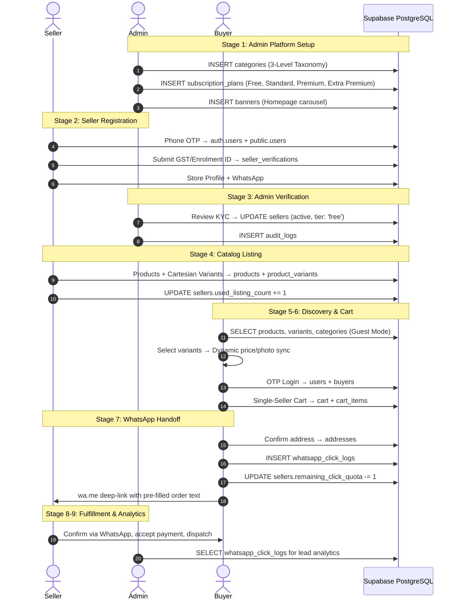

# YYME-1 — Refurbished Implementation Plan (v2)

> **Project**: `yyme-1` (clean codebase, new Supabase DB)
> **Phase 1 Target**: WhatsApp-Direct Order Engine, Single-Seller Cart, Tiered Monetization, Simplified Catalog
> **Reference Files**: `current_implementation.md`, `current_implementation_2.md`, `new_implementation.md`, `refurbished.md`, `tables.md`

---

## 1. Strategic Context: Why Refurbish?

### 1.1 Current State (yyme — old codebase)

The existing `yyme` project implements a full-featured multi-vendor marketplace with:
- In-app checkout with escrow payments and 7-day bank settlement
- Multi-seller cart with order splitting at checkout
- Dynamic 2D delivery matrix (Haversine GPS + distance/weight slabs)
- Mandatory Admin QC gate before product publishing
- GST/TCS/commission financial engine with `order_financial_breakdown`
- Complex seller onboarding (GSTIN + Bank + Disability + Warehouse)
- State-based product visibility filtering
- 32+ database tables with heavy interdependencies

**Problem**: High friction to launch. Too many moving parts for Phase 1 validation. Buyers abandon checkout when payment fails. Sellers can't list until bank is verified. Delivery calculation requires GPS coordinates from both parties.

### 1.2 Refurbished State (yyme-1 — new codebase)

The new architecture strips to a **WhatsApp-Direct Order Engine**:

| Dimension | Old (`yyme`) | New (`yyme-1`) |
|---|---|---|
| **Ordering** | In-app payment gateway + transaction simulation | **WhatsApp deep-link** with pre-filled order message |
| **Cart** | Multi-seller cart + complex order splitting | **Single-seller cart** (1 merchant per session) |
| **Financial** | Escrow, 7-day payout, commission, TCS | **Offline settlement** (buyer pays seller directly) |
| **Monetization** | Commission % + 18% service tax | **Tiered subscription + pay-per-lead** via click logs |
| **Logistics** | 2D delivery matrix, Haversine GPS | **Direct arrangement** (buyer/seller coordinate in WhatsApp) |
| **QC** | Mandatory `pending_qc → published` gate | **Immediate publishing** upon seller activation |
| **Visibility** | State-filtered, geo-restricted | **National visibility** in Guest Mode (zero login) |
| **Onboarding** | GST + Bank + Disability + Warehouse (7 steps) | **Store Profile + WhatsApp # + KYC** (simplified) |
| **DB Tables** | 32+ tables with heavy relations | **14 core tables** (clean, minimal) |

### 1.3 What We Keep From Old Codebase

These proven patterns transfer directly to `yyme-1`:
- React 18 + Vite + TypeScript + Tailwind CSS + TanStack React Query stack
- Supabase (PostgreSQL + Auth + Storage + Real-time)
- npm workspaces monorepo structure
- Shared UI component library (`@ymenet/ui`)
- Shared utilities (`@ymenet/utils`)
- Leaflet/React-Leaflet for address map picking
- OTP authentication flow (phone → SMS → verify)
- Category 3-level hierarchy (L1 → L2 → L3)
- Cartesian variant matrix generator
- Image upload to Supabase storage buckets

### 1.4 What We Drop From Old Codebase

| Dropped Component | Reason |
|---|---|
| CartContext multi-seller logic | Replaced by single-seller cart |
| order_financial_breakdown | No in-app financial settlement |
| payments table (escrow) | Offline settlement only |
| payouts table | No automated payouts |
| shipments table | No in-app courier integration |
| returns table | Phase 2 feature |
| delivery_disputes table | Phase 2 feature |
| seller_delivery_settings | No delivery matrix |
| partner_delivery_rules | No delivery matrix |
| delivery_charge_matrix | No delivery matrix |
| non_gst_threshold_tracker | Phase 2 feature |
| seller_freeze_flags | Phase 2 feature |
| platform_commission | Subscription-based monetization instead |
| gst_slabs | Phase 2 feature |
| category_gst_rules | Phase 2 feature |
| rate_config | Phase 2 feature |
| status_history | Simplified audit_logs instead |
| notifications table | Phase 2 feature |
| Admin QC pages | Immediate publishing |
| Buyer checkout flow (Payment.tsx) | Replaced by WhatsApp handoff |
| Buyer order tracking | No in-app order lifecycle |
| Buyer returns/refund | Phase 2 feature |
| Seller dispatch modal | Direct arrangement |
| Seller delivery charge page | No delivery matrix |
| Admin disputes page | Phase 2 feature |
| Admin platform config page | Subscription plans replace commission |

---

## 2. Complete System Flow

### 2.1 End-to-End Sequence

```
STAGE 1: ADMIN SETUP
  Admin → Creates 3-level category taxonomy
  Admin → Seeds subscription_plans table (Free, Standard, Premium, Extra Premium)
  Admin → Configures homepage banners

STAGE 2: SELLER ONBOARDING & VERIFICATION
  Seller → Phone OTP signup → auth.users + public.users
  Seller → GST Track (15-char GSTIN) OR Non-GST Track (PAN + Enrolment ID)
  Seller → Store Profile: business_name, whatsapp_number, owner_name, warehouse address
  Seller → Optional: Disability certificate upload
  → INSERT sellers (account_status: 'pending_verification')
  → INSERT seller_verifications
  → INSERT addresses (owner_type: 'seller')

STAGE 3: ADMIN VERIFICATION
  Admin → Reviews identity proof, WhatsApp #, warehouse address
  → ON APPROVE: UPDATE sellers (account_status: 'active', tier: 'free', click_quota: 20, listing_quota: 3)
  → ON REJECT: UPDATE sellers (account_status: 'rejected')
  → INSERT audit_logs

STAGE 4: SELLER CATALOG LISTING
  Seller → Select L3 category, enter product details
  Seller → Define option tags (Color, Size) → Cartesian matrix generator
  → INSERT products (publish_status: 'published' — immediate, no QC)
  → INSERT product_variants
  → UPDATE sellers.used_listing_count += 1

STAGE 5: BUYER DISCOVERY (GUEST MODE)
  Buyer → Browse all published products nationally (zero login)
  Buyer → Select variant options (dynamic price, MRP, photo sync)
  Buyer → Click "Add to Cart" or "Order via WhatsApp"

STAGE 6: BUYER AUTH & SINGLE-SELLER CART
  Buyer → Phone OTP login (if not already)
  Buyer → Single-seller cart enforcement
  → INSERT/UPDATE cart + cart_items

STAGE 7: CHECKOUT & WHATSAPP HANDOFF
  Buyer → Confirm delivery address
  → INSERT whatsapp_click_logs (seller_id, product_id, variant_id, buyer_id, price)
  → UPDATE sellers.remaining_click_quota -= 1
  → Launch wa.me/91{WHATSAPP_NUMBER}?text={PRE_FILLED_ORDER}

STAGE 8: EXTERNAL FULFILLMENT
  Seller ↔ Buyer communicate in WhatsApp
  Seller confirms availability, accepts payment (UPI/COD), dispatches

STAGE 9: ADMIN MONETIZATION
  Admin → Views whatsapp_click_logs analytics (leads, top sellers, popular products, pin codes)
  Admin → Manages subscription upgrade requests (UTR validation)
```

### 2.2 Mermaid Sequence Diagram



---

## 3. New Database Schema (14 Tables)

### 3.1 Complete DDL

```sql
-- ============================================================================
-- YYME-1 PHASE 1 — CLEAN SCHEMA (New Supabase Project)
-- ============================================================================

-- 1. USERS & AUTH IDENTITY
CREATE TABLE public.users (
  user_id uuid PRIMARY KEY DEFAULT gen_random_uuid(),
  phone_number varchar NOT NULL UNIQUE,
  email varchar,
  user_type varchar NOT NULL CHECK (user_type IN ('admin', 'buyer', 'seller')),
  is_active boolean NOT NULL DEFAULT true,
  created_at timestamptz NOT NULL DEFAULT CURRENT_TIMESTAMP,
  last_login_at timestamptz
);

-- 2. BUYERS PROFILE
CREATE TABLE public.buyers (
  buyer_id uuid PRIMARY KEY DEFAULT gen_random_uuid(),
  user_id uuid NOT NULL UNIQUE REFERENCES public.users(user_id) ON DELETE CASCADE,
  full_name varchar NOT NULL,
  default_address_id uuid,
  created_at timestamptz NOT NULL DEFAULT CURRENT_TIMESTAMP
);

-- 3. SELLERS PROFILE + SUBSCRIPTION QUOTAS
CREATE TABLE public.sellers (
  seller_id uuid PRIMARY KEY DEFAULT gen_random_uuid(),
  user_id uuid NOT NULL UNIQUE REFERENCES public.users(user_id) ON DELETE CASCADE,
  business_name varchar NOT NULL,
  owner_name varchar NOT NULL,
  whatsapp_number varchar NOT NULL,
  seller_type varchar NOT NULL DEFAULT 'standard',
  account_status varchar NOT NULL DEFAULT 'pending_verification'
    CHECK (account_status IN ('pending_verification', 'active', 'rejected', 'frozen', 'suspended')),
  is_gst_registered boolean NOT NULL DEFAULT false,
  shipping_state varchar NOT NULL,

  -- Subscription & Quota Engine
  subscription_tier varchar NOT NULL DEFAULT 'free'
    CHECK (subscription_tier IN ('free', 'standard', 'premium', 'extra_premium')),
  is_disability_exempt boolean NOT NULL DEFAULT false,
  click_quota integer NOT NULL DEFAULT 20,
  remaining_click_quota integer NOT NULL DEFAULT 20,
  max_listing_quota integer NOT NULL DEFAULT 3,
  used_listing_count integer NOT NULL DEFAULT 0,
  tier_expires_at timestamptz,

  rejection_reason text,
  created_at timestamptz NOT NULL DEFAULT CURRENT_TIMESTAMP,
  updated_at timestamptz NOT NULL DEFAULT CURRENT_TIMESTAMP
);

-- 4. SELLER VERIFICATIONS (KYC & IDENTITY)
CREATE TABLE public.seller_verifications (
  record_id uuid PRIMARY KEY DEFAULT gen_random_uuid(),
  seller_id uuid NOT NULL REFERENCES public.sellers(seller_id) ON DELETE CASCADE,
  verification_type varchar NOT NULL CHECK (verification_type IN ('GST', 'ENROLLMENT_ID', 'DISABILITY_PROOF')),
  reference_number varchar NOT NULL,
  document_url text,
  status varchar NOT NULL DEFAULT 'pending' CHECK (status IN ('pending', 'verified', 'rejected')),
  verified_on timestamptz,
  rejection_reason text,
  created_at timestamptz NOT NULL DEFAULT CURRENT_TIMESTAMP
);

-- 5. SUBSCRIPTION PLANS (Master Reference)
CREATE TABLE public.subscription_plans (
  plan_id varchar PRIMARY KEY,
  name varchar NOT NULL,
  monthly_price numeric NOT NULL DEFAULT 0.00,
  click_quota integer NOT NULL,
  listing_quota integer NOT NULL,
  description text
);

INSERT INTO public.subscription_plans (plan_id, name, monthly_price, click_quota, listing_quota, description) VALUES
('free', 'Free Tier', 0.00, 20, 3, 'Kickstarter tier granted on KYC approval'),
('standard', 'Standard Tier', 499.00, 100, 10, 'For growing home-based merchants'),
('premium', 'Premium Tier', 1499.00, 500, 50, 'For high-volume artisans and stores'),
('extra_premium', 'Extra Premium Tier', 2999.00, 2000, 200, 'Unlimited growth for large enterprises');

-- 6. SUBSCRIPTION UPGRADE REQUESTS (Payment Proofs)
CREATE TABLE public.subscription_upgrade_requests (
  request_id uuid PRIMARY KEY DEFAULT gen_random_uuid(),
  seller_id uuid NOT NULL REFERENCES public.sellers(seller_id) ON DELETE CASCADE,
  target_plan_id varchar NOT NULL REFERENCES public.subscription_plans(plan_id),
  amount_paid numeric NOT NULL,
  payment_method varchar NOT NULL DEFAULT 'UPI',
  utr_reference_number varchar NOT NULL,
  payment_receipt_url text,
  status varchar NOT NULL DEFAULT 'pending_approval'
    CHECK (status IN ('pending_approval', 'approved', 'rejected')),
  reviewed_by uuid,
  reviewed_at timestamptz,
  rejection_reason text,
  created_at timestamptz NOT NULL DEFAULT CURRENT_TIMESTAMP
);

-- 7. CATEGORIES (3-Level Hierarchy)
CREATE TABLE public.categories (
  category_id varchar PRIMARY KEY,
  parent_category_id varchar REFERENCES public.categories(category_id) ON DELETE CASCADE,
  level integer NOT NULL CHECK (level IN (1, 2, 3)),
  name varchar NOT NULL,
  icon_url text,
  display_order integer DEFAULT 0,
  created_at timestamptz NOT NULL DEFAULT CURRENT_TIMESTAMP
);

-- 8. ADDRESSES (Polymorphic: Buyer & Seller)
CREATE TABLE public.addresses (
  address_id uuid PRIMARY KEY DEFAULT gen_random_uuid(),
  owner_type varchar NOT NULL CHECK (owner_type IN ('buyer', 'seller')),
  owner_id uuid NOT NULL,
  address_line1 text NOT NULL,
  address_line2 text,
  city varchar NOT NULL,
  district varchar,
  state varchar NOT NULL,
  pincode varchar NOT NULL,
  lat numeric,
  long numeric,
  is_default boolean NOT NULL DEFAULT true,
  created_at timestamptz NOT NULL DEFAULT CURRENT_TIMESTAMP
);

-- 9. PRODUCTS
CREATE TABLE public.products (
  product_id uuid PRIMARY KEY DEFAULT gen_random_uuid(),
  seller_id uuid NOT NULL REFERENCES public.sellers(seller_id) ON DELETE CASCADE,
  category_id varchar NOT NULL REFERENCES public.categories(category_id),
  name varchar NOT NULL,
  description text,
  material varchar,
  weight_kg numeric DEFAULT 0.5,
  moq integer NOT NULL DEFAULT 1 CHECK (moq >= 1),
  base_price numeric NOT NULL CHECK (base_price >= 0.00),
  mrp numeric NOT NULL DEFAULT 0.00 CHECK (mrp >= 0.00),
  stock_quantity integer NOT NULL DEFAULT 0 CHECK (stock_quantity >= 0),
  have_variants boolean NOT NULL DEFAULT false,
  image_urls text[] DEFAULT '{}'::text[],
  is_active boolean NOT NULL DEFAULT true,
  created_at timestamptz NOT NULL DEFAULT CURRENT_TIMESTAMP,
  updated_at timestamptz NOT NULL DEFAULT CURRENT_TIMESTAMP
);

-- 10. PRODUCT VARIANTS (SKU Matrix)
CREATE TABLE public.product_variants (
  variant_id uuid PRIMARY KEY DEFAULT gen_random_uuid(),
  product_id uuid NOT NULL REFERENCES public.products(product_id) ON DELETE CASCADE,
  variant_type varchar NOT NULL,
  variant_value varchar NOT NULL,
  sku varchar,
  selling_price numeric NOT NULL CHECK (selling_price >= 0.00),
  mrp numeric DEFAULT 0.00,
  stock_quantity integer NOT NULL DEFAULT 0 CHECK (stock_quantity >= 0),
  weight_override numeric,
  image_urls text[] DEFAULT '{}'::text[],
  created_at timestamptz NOT NULL DEFAULT CURRENT_TIMESTAMP
);

-- 11. SHOPPING CART (Single-Seller Enforced)
CREATE TABLE public.cart (
  cart_id uuid PRIMARY KEY DEFAULT gen_random_uuid(),
  buyer_id uuid NOT NULL UNIQUE REFERENCES public.buyers(buyer_id) ON DELETE CASCADE,
  seller_id uuid REFERENCES public.sellers(seller_id) ON DELETE SET NULL,
  updated_at timestamptz NOT NULL DEFAULT CURRENT_TIMESTAMP
);

CREATE TABLE public.cart_items (
  cart_item_id uuid PRIMARY KEY DEFAULT gen_random_uuid(),
  cart_id uuid NOT NULL REFERENCES public.cart(cart_id) ON DELETE CASCADE,
  product_id uuid NOT NULL REFERENCES public.products(product_id) ON DELETE CASCADE,
  variant_id uuid REFERENCES public.product_variants(variant_id) ON DELETE SET NULL,
  quantity integer NOT NULL DEFAULT 1 CHECK (quantity >= 1),
  created_at timestamptz NOT NULL DEFAULT CURRENT_TIMESTAMP
);

-- 12. WHATSAPP CLICK LOGS (Lead Analytics & Monetization)
CREATE TABLE public.whatsapp_click_logs (
  log_id uuid PRIMARY KEY DEFAULT gen_random_uuid(),
  seller_id uuid NOT NULL REFERENCES public.sellers(seller_id) ON DELETE CASCADE,
  product_id uuid NOT NULL REFERENCES public.products(product_id) ON DELETE CASCADE,
  variant_id uuid REFERENCES public.product_variants(variant_id) ON DELETE SET NULL,
  buyer_id uuid REFERENCES public.buyers(buyer_id) ON DELETE SET NULL,
  buyer_phone varchar,
  buyer_pincode varchar,
  item_price numeric NOT NULL,
  clicked_at timestamptz NOT NULL DEFAULT CURRENT_TIMESTAMP
);

-- 13. PROMOTIONAL BANNERS
CREATE TABLE public.banners (
  banner_id uuid PRIMARY KEY DEFAULT gen_random_uuid(),
  title varchar NOT NULL,
  image_url text NOT NULL,
  link_url text,
  display_order integer NOT NULL DEFAULT 0,
  is_active boolean NOT NULL DEFAULT true,
  created_at timestamptz NOT NULL DEFAULT CURRENT_TIMESTAMP
);

-- 14. ADMIN AUDIT TRAIL
CREATE TABLE public.audit_logs (
  log_id uuid PRIMARY KEY DEFAULT gen_random_uuid(),
  admin_id uuid NOT NULL,
  action varchar NOT NULL,
  target_id uuid,
  details jsonb DEFAULT '{}'::jsonb,
  performed_on timestamptz NOT NULL DEFAULT CURRENT_TIMESTAMP
);

-- ============================================================================
-- PERFORMANCE INDEXES
-- ============================================================================
CREATE INDEX idx_products_seller ON public.products(seller_id);
CREATE INDEX idx_products_category ON public.products(category_id);
CREATE INDEX idx_products_publish ON public.products(is_active);
CREATE INDEX idx_variants_product ON public.product_variants(product_id);
CREATE INDEX idx_click_logs_seller ON public.whatsapp_click_logs(seller_id, clicked_at);
CREATE INDEX idx_click_logs_pincode ON public.whatsapp_click_logs(buyer_pincode);
CREATE INDEX idx_sellers_status ON public.sellers(account_status);
CREATE INDEX idx_cart_buyer ON public.cart(buyer_id);
CREATE INDEX idx_cart_items_cart ON public.cart_items(cart_id);
CREATE INDEX idx_addresses_owner ON public.addresses(owner_type, owner_id);
CREATE INDEX idx_categories_parent ON public.categories(parent_category_id);
CREATE INDEX idx_upgrade_requests_seller ON public.subscription_upgrade_requests(seller_id);
```

### 3.2 Table Summary

| # | Table | Purpose | Key Relationships |
|---|---|---|---|
| 1 | `users` | Auth identity (phone, email, role) | FK to auth.users |
| 2 | `buyers` | Buyer profile + default address | FK → users |
| 3 | `sellers` | Seller profile + subscription quotas | FK → users |
| 4 | `seller_verifications` | KYC docs (GST/Enrolment/Disability) | FK → sellers |
| 5 | `subscription_plans` | Plan definitions (Free→Extra Premium) | Master reference |
| 6 | `subscription_upgrade_requests` | UTR payment proofs for upgrades | FK → sellers, subscription_plans |
| 7 | `categories` | 3-level taxonomy (L1→L2→L3) | Self-referencing FK |
| 8 | `addresses` | Polymorphic (buyer/seller) locations | owner_type + owner_id |
| 9 | `products` | Product catalog (immediate publish) | FK → sellers, categories |
| 10 | `product_variants` | SKU matrix with selling_price + mrp | FK → products |
| 11 | `cart` | Single-seller cart header | FK → buyers, sellers |
| 12 | `cart_items` | Cart line items | FK → cart, products, variants |
| 13 | `whatsapp_click_logs` | Lead tracking + monetization | FK → sellers, products, buyers |
| 14 | `banners` | Homepage carousel slides | Standalone |
| 15 | `audit_logs` | Admin action trail | admin_id reference |

### 3.3 Entity Relationships

```
users (1) ──── (1) buyers
users (1) ──── (1) sellers

buyers (1) ──── (N) addresses (owner_type='buyer')
buyers (1) ──── (1) cart
buyers (1) ──── (N) whatsapp_click_logs

sellers (1) ──── (N) addresses (owner_type='seller')
sellers (1) ──── (N) seller_verifications
sellers (1) ──── (N) products
sellers (1) ──── (N) subscription_upgrade_requests
sellers (1) ──── (N) whatsapp_click_logs

categories (1) ──── (N) categories (self-referencing)
categories (1) ──── (N) products

products (1) ──── (N) product_variants
products (1) ──── (N) cart_items
products (1) ──── (N) whatsapp_click_logs

cart (1) ──── (N) cart_items
cart_items (N) ──── (1) product_variants

subscription_plans (1) ──── (N) subscription_upgrade_requests
```

---

## 4. Portal-by-Portal Implementation Plan

### 4.1 Buyer Portal (`apps/buyer`)

#### File Structure
```
apps/buyer/src/
├── main.tsx                     # React entry: QueryProvider → BrowserRouter → App
├── App.tsx                      # Wraps in CartProvider → {element}
├── routes.tsx                   # Route definitions
├── supabaseClient.ts            # Supabase client + MockAuth fallback
├── core/
│   ├── contexts/
│   │   ├── AuthContext.tsx       # Buyer session, phone OTP login
│   │   └── CartContext.tsx       # Single-seller cart enforcement
│   ├── hooks/
│   │   ├── useProducts.ts       # National catalog query + Realtime
│   │   └── useCategories.ts     # 3-tier taxonomy cache
│   ├── providers/
│   │   └── QueryProvider.tsx
│   └── queryKeys.ts             # buyerKeys factory
├── utils/
│   └── deliveryCalculator.ts    # REMOVED — no delivery matrix in Phase 1
├── layouts/
│   └── BuyerLayout.tsx          # Navbar, search, cart badge, user dropdown
├── components/
│   ├── RequireAuth.tsx          # Route guard (session check)
│   └── VariantSelector.tsx      # Dynamic attribute pill selector
└── pages/
    ├── home/Home.tsx            # Banners, categories, trending products
    ├── auth/
    │   ├── LoginModal.tsx       # Lightweight bottom-sheet OTP modal
    │   └── OtpVerify.tsx        # 6-digit SMS verification
    ├── discovery/
    │   ├── Products.tsx         # National catalog grid
    │   ├── ProductDetail.tsx    # Variant pills, price sync, WhatsApp CTA
    │   ├── CategoryListing.tsx  # L1→L2→L3 drill-down
    │   └── SearchResults.tsx    # Debounced keyword search
    ├── cart/
    │   └── Cart.tsx             # Single-seller cart summary
    └── checkout/
        └── WhatsAppHandoff.tsx  # Address confirm + click log + wa.me redirect
```

#### Key Components

**`CartContext.tsx` — Single-Seller Cart**

State:
- `cart: CartItem[]` — `{productId, variantId, name, sellingPrice, mrp, image, sellerId, sellerName, quantity}`
- `cartSellerId: string | null` — Enforced single seller
- `cartSellerName: string | null`
- `cartTotal: number` — Derived

Functions:
- `addToCart(item)`:
  ```
  IF cartSellerId !== null AND cartSellerId !== item.sellerId:
    → Show confirmation modal: "Clear cart to add from [Store B]?"
    → If confirm: clearCart() then insert
    → If cancel: return
  ELSE:
    → Insert/increment in cart + cart_items
  ```
- `removeFromCart(productId, variantId?)`
- `updateQuantity(productId, quantity, variantId?)`
- `clearCart()` — Resets cartSellerId to null

Database: `cart`, `cart_items` (insert/update/delete)

**`WhatsAppHandoff.tsx` — Order Handoff**

Flow:
1. Fetch buyer's default address from `addresses`
2. Show address confirmation card
3. On "Order via WhatsApp" click:
   ```typescript
   // 1. Log click for monetization
   await supabase.from('whatsapp_click_logs').insert({
     seller_id: activeItem.sellerId,
     product_id: activeItem.productId,
     variant_id: activeItem.variantId,
     buyer_id: session?.user?.id || null,
     buyer_phone: buyerPhone,
     buyer_pincode: address.pincode,
     item_price: activeItem.sellingPrice,
   });

   // 2. Decrement seller's remaining click quota
   await supabase.rpc('decrement_click_quota', { sid: activeItem.sellerId });

   // 3. Build WhatsApp deep-link
   const message = `Hi ${sellerName}! I want to place an order on yymee:\n\n🛍️ *Product:* ${productName}\n🎨 *Variant:* ${variantAttrs}\n💰 *Price:* ₹${price} (MRP: ₹${mrp})\n📦 *Quantity:* ${qty}\n📍 *Delivery Address:* ${fullAddress}\n\nPlease confirm availability and payment details.`;
   const url = `https://wa.me/91${whatsappNumber}?text=${encodeURIComponent(message)}`;
   window.open(url, '_blank');

   // 4. Clear cart
   clearCart();
   ```

**`ProductDetail.tsx` — Variant Selection**

State:
- `selectedVariant: Variant | null`
- `selectedAttributes: Record<string, string>` — e.g., `{Color: "Blue", Size: "XL"}`

Logic:
- Group variants by `variant_type` → extract unique values per type
- Render attribute pills grouped by type
- On pill click: update `selectedAttributes`, find matching variant
- Sync: selling_price, mrp, discount badge `Math.round(((mrp - price) / mrp) * 100)% OFF`, image carousel, stock status

Database Read: `products`, `product_variants`

**`BuyerLayout.tsx` — Navigation**

Features:
- Logo + search bar (debounced → `/search?q=`)
- Cart badge (cartCount from CartContext)
- User dropdown (if logged in): My Profile, Saved Addresses, Notifications
- If not logged in: Sign Up / Login prompt

**`useProducts.ts` — Catalog Query**

```typescript
const { data } = useQuery({
  queryKey: buyerKeys.products(),
  queryFn: async () => {
    const { data: products } = await supabase
      .from('products')
      .select('*, sellers(business_name, whatsapp_number, is_gst_registered), categories(name)')
      .eq('is_active', true);

    const productIds = products.map(p => p.product_id);
    const { data: variants } = await supabase
      .from('product_variants')
      .select('*')
      .in('product_id', productIds);

    // Map to buyer-friendly format with variants grouped
  }
});
// Realtime subscription on products + product_variants
```

---

### 4.2 Seller Portal (`apps/seller`)

#### File Structure
```
apps/seller/src/
├── main.tsx
├── App.tsx
├── routes.tsx
├── supabaseClient.ts
├── core/
│   ├── contexts/
│   │   ├── SellerAuthContext.tsx  # Session + seller profile + active tier
│   │   └── QuotaContext.tsx       # Live remaining clicks & listing counts
│   ├── hooks/
│   │   ├── useCartesianMatrix.ts  # Generates N x M variant matrix
│   │   └── useSellerId.ts        # Resolves seller_id from user session
│   ├── providers/
│   │   └── QueryProvider.tsx
│   └── queryKeys.ts              # sellerKeys factory
└── pages/
    ├── landing/
    │   ├── Landing.tsx            # Hero + features + CTA
    │   └── LandingLayout.tsx      # Public landing layout
    ├── onboarding/
    │   ├── PhoneEntry.tsx         # Mobile OTP registration
    │   ├── SellerTypeFork.tsx     # GST vs Non-GST fork
    │   ├── GstinEntry.tsx         # 15-char GSTIN validation
    │   ├── EnrolmentEntry.tsx     # PAN + Enrolment ID generator
    │   ├── StoreProfile.tsx       # Store name, WhatsApp #, warehouse
    │   ├── DisabilityCertUpload.tsx  # Optional disability proof
    │   └── ApprovalPending.tsx    # Verification status polling
    ├── login/
    │   └── Login.tsx              # OTP login for existing sellers
    ├── dashboard/
    │   ├── DashboardHome.tsx      # Quota gauges, lead counts, recent clicks
    │   └── AnalyticsTab.tsx       # WhatsApp leads by product/pincode
    ├── product/
    │   ├── ProductListPage.tsx    # Product cards with stock & status
    │   └── ProductAddPage.tsx     # Cartesian variant matrix + bulk edit
    └── subscription/
        ├── UpgradeModal.tsx       # Plan cards & feature comparison
        └── PaymentProofSubmit.tsx # UPI QR, UTR input, receipt upload
```

#### Key Components

**`SellerAuthContext.tsx` — Session Management**

```typescript
interface SellerAuthContextType {
  user: User | null;
  seller: SellerProfile | null;
  loading: boolean;
  login: (phone: string) => Promise<void>;
  logout: () => Promise<void>;
}

// On session established:
// 1. Check public.users WHERE user_id = session.user.id
// 2. Fetch public.sellers WHERE user_id = session.user.id
// 3. Return seller profile with subscription_tier, quotas
```

**`QuotaContext.tsx` — Quota Enforcement**

State:
- `remainingClicks: number`
- `usedListings: number`
- `maxListings: number`
- `subscriptionTier: string`
- `isDisabilityExempt: boolean`

Logic:
- If `remainingClicks <= 0`: Block WhatsApp order button for this seller's products
- If `usedListings >= maxListings`: Block "Add Product" button, show upgrade prompt
- If `isDisabilityExempt`: Unlimited everything (skip all checks)

Functions:
- `decrementClicks()`: `UPDATE sellers SET remaining_click_quota -= 1`
- `incrementListings()`: `UPDATE sellers SET used_listing_count += 1`
- `checkCanAddProduct(): boolean`
- `checkCanWhatsAppOrder(): boolean`

Database: `sellers` (read/update)

**`useCartesianMatrix.ts` — Variant Generator**

```typescript
function generateCartesianMatrix(
  optionTypes: string[],        // ['Color', 'Size']
  optionValues: string[][]      // [['Red','Blue'], ['S','M','XL']]
): VariantRow[] {
  // Returns N x M combinations:
  // Red/S, Red/M, Red/XL, Blue/S, Blue/M, Blue/XL
  // Each row: { variant_type: "Color / Size", variant_value: "Red / S", selling_price, mrp, stock_quantity, sku, weight_override, image_urls }
}
```

**`ProductAddPage.tsx` — Product Creation**

Flow:
1. **Basic Info**: name, description, material, weight_kg, moq, category (L3)
2. **Photos**: Drag-drop uploader → Supabase `product-images` bucket (WebP conversion)
3. **Variants**: Define option tags → Cartesian matrix → Bulk edit bar (set all MRP, price, stock) → Row-level overrides
4. **Submit**:
   ```typescript
   // Check listing quota
   if (seller.used_listing_count >= seller.max_listing_quota) {
     // Show UpgradeModal
     return;
   }

   // Insert product
   const { data: product } = await supabase.from('products').insert({
     seller_id, category_id, name, description, material, weight_kg,
     moq, base_price, mrp, stock_quantity: totalMatrixStock,
     have_variants: true, image_urls, is_active: true
   }).select().single();

   // Insert variants
   await supabase.from('product_variants').insert(variantRows);

   // Increment listing count
   await supabase.rpc('increment_listing_count', { sid: sellerId });
   ```

Database Write: `products`, `product_variants`, `sellers` (quota update)

**`SubscriptionUpgradeRequest.tsx` — Plan Upgrade**

Flow:
1. Display plan cards (Standard ₹499, Premium ₹1,499, Extra Premium ₹2,999)
2. Show UPI QR code for payment
3. Buyer pays → enters UTR reference number → optional receipt upload
4. Submit:
   ```typescript
   await supabase.from('subscription_upgrade_requests').insert({
     seller_id, target_plan_id, amount_paid,
     payment_method: 'UPI', utr_reference_number: utr,
     status: 'pending_approval'
   });
   ```
5. Wait for admin approval

Database Write: `subscription_upgrade_requests`

---

### 4.3 Admin Portal (`apps/admin`)

#### File Structure
```
apps/admin/src/
├── main.tsx
├── App.tsx
├── routes.tsx
├── supabaseClient.ts
├── core/
│   ├── contexts/
│   │   └── AuthContext.tsx        # Admin auth: email/password + role check
│   ├── providers/
│   │   └── QueryProvider.tsx
│   ├── queryKeys.ts              # adminKeys factory
│   └── types/
│       └── auth.ts               # AdminRole, AdminPermission types
├── layout/
│   └── Sidebar.tsx               # Sidebar with menu sections
└── pages/
    ├── auth/
    │   └── LoginPage.tsx         # Email/password login
    ├── dashboard/
    │   └── LeadAnalyticsPage.tsx  # WhatsApp lead metrics + top sellers
    ├── verifications/
    │   └── SellerIdentityQueue.tsx  # KYC approval queue
    ├── subscriptions/
    │   └── UpgradeRequestsQueue.tsx  # UTR payment validation queue
    ├── categories/
    │   └── CategoryHierarchyPage.tsx  # 3-level taxonomy editor
    └── promotions/
        └── BannerManager.tsx      # Homepage carousel CRUD
```

#### Key Components

**`AuthContext.tsx` — Admin Authentication**

Same pattern as old codebase:
1. Email/password login via `supabase.auth.signInWithPassword()`
2. Verify `users.user_type === 'admin'` AND `users.is_active`
3. Load `admins.role` and `permissions`
4. Roles: `super_admin`, `admin`, `moderator`

**`SellerIdentityQueue.tsx` — KYC Verification**

Query: `sellers WHERE account_status = 'pending_verification'`

Display: Table with business_name, whatsapp_number, identity proof, warehouse address

Actions:
- **Approve**:
  ```typescript
  await supabase.from('sellers').update({
    account_status: 'active',
    subscription_tier: 'free',
    click_quota: 20,
    remaining_click_quota: 20,
    max_listing_quota: 3,
  }).eq('seller_id', sellerId);

  await supabase.from('seller_verifications').update({
    status: 'verified',
    verified_on: new Date().toISOString(),
  }).eq('seller_id', sellerId);

  // If disability proof verified:
  if (hasDisabilityProof) {
    await supabase.from('sellers').update({
      is_disability_exempt: true,
      click_quota: 999999,
      remaining_click_quota: 999999,
      max_listing_quota: 999999,
    }).eq('seller_id', sellerId);
  }

  await supabase.from('audit_logs').insert({
    admin_id, action: 'SELLER_IDENTITY_APPROVED', target_id: sellerId,
  });
  ```

- **Reject**:
  ```typescript
  await supabase.from('sellers').update({
    account_status: 'rejected',
    rejection_reason: reasonText,
  }).eq('seller_id', sellerId);

  await supabase.from('audit_logs').insert({
    admin_id, action: 'SELLER_IDENTITY_REJECTED', target_id: sellerId,
    details: { reason: reasonText },
  });
  ```

Database: `sellers` (update), `seller_verifications` (update), `audit_logs` (insert)

**`UpgradeRequestsQueue.tsx` — Subscription Upgrade Validation**

Query: `subscription_upgrade_requests WHERE status = 'pending_approval'`

Display: Seller name, target plan, amount paid, UTR reference, payment receipt

Actions:
- **Approve**:
  ```typescript
  // 1. Update request status
  await supabase.from('subscription_upgrade_requests').update({
    status: 'approved', reviewed_by: adminId, reviewed_at: new Date().toISOString(),
  }).eq('request_id', requestId);

  // 2. Activate seller's new tier
  const plan = await supabase.from('subscription_plans').select('*').eq('plan_id', targetPlanId).single();
  await supabase.from('sellers').update({
    subscription_tier: targetPlanId,
    click_quota: plan.click_quota,
    remaining_click_quota: plan.click_quota,
    max_listing_quota: plan.listing_quota,
    tier_expires_at: new Date(Date.now() + 30 * 24 * 60 * 60 * 1000).toISOString(),
  }).eq('seller_id', sellerId);

  await supabase.from('audit_logs').insert({
    admin_id, action: 'SUBSCRIPTION_UPGRADE_APPROVED', target_id: sellerId,
    details: { plan: targetPlanId, utr: utrNumber },
  });
  ```

- **Reject**:
  ```typescript
  await supabase.from('subscription_upgrade_requests').update({
    status: 'rejected', rejection_reason: reasonText,
  }).eq('request_id', requestId);
  ```

Database: `subscription_upgrade_requests` (update), `sellers` (update), `audit_logs` (insert)

**`LeadAnalyticsPage.tsx` — Monetization Dashboard**

Queries:
```typescript
// Total leads today/week/month
const { count: totalLeads } = await supabase
  .from('whatsapp_click_logs')
  .select('*', { count: 'exact', head: true })
  .gte('clicked_at', startOfPeriod);

// Top sellers by lead volume
const { data: topSellers } = await supabase
  .from('whatsapp_click_logs')
  .select('seller_id, sellers(business_name)')
  .gte('clicked_at', startOfPeriod)
  // Group by seller_id, count

// Most clicked products
const { data: topProducts } = await supabase
  .from('whatsapp_click_logs')
  .select('product_id, products(name)')
  .gte('clicked_at', startOfPeriod)
  // Group by product_id, count

// High-demand pincodes
const { data: hotPincodes } = await supabase
  .from('whatsapp_click_logs')
  .select('buyer_pincode')
  .not('buyer_pincode', 'is', null)
  .gte('clicked_at', startOfPeriod)
  // Group by pincode, count
```

Display: KPI cards, ranked tables, geographic heatmap

**`CategoryHierarchyPage.tsx` — Taxonomy Editor**

Operations:
- Create/edit/delete L1 (Department), L2 (Sub-category), L3 (Product Type)
- Drag-and-drop reordering
- Display order management

Database: `categories` (CRUD)

**`BannerManager.tsx` — Homepage Carousel**

Operations:
- Upload banner image → `product-images` bucket
- Set title, link_url, display_order, is_active
- Reorder, activate/deactivate, delete

Database: `banners` (CRUD)

---

## 5. Edge Functions (Supabase Deno Runtime)

### 5.1 `create-seller-bypass/index.ts`

Purpose: Create seller account bypassing RLS.

Input: `{phone: string}`

Flow:
1. Format phone as `+91{phone}`
2. Check `public.users` for existing phone → reject if exists
3. Create `auth.users` (phone_confirm: true, email: `{phone}@seller.yymee.com`)
4. Insert `public.users` (user_type: 'seller')
5. Insert `public.sellers` (account_status: 'pending_verification', subscription_tier: 'free')
6. Return `{success, userId, sellerId}`

### 5.2 `create-buyer-bypass/index.ts`

Purpose: Create buyer account bypassing RLS.

Input: `{phone: string, name: string, email: string}`

Flow:
1. Format phone, check for existing
2. Create `auth.users` (shadow email: `{phone}@buyer.yymee.com`)
3. Insert `public.users` (user_type: 'buyer')
4. Insert `public.buyers` (full_name: name)
5. Return `{success, userId}`

---

## 6. Storage Buckets

| Bucket | Access | Content | Use Case |
|---|---|---|---|
| `product-images` | Public Read | image/png, image/jpeg, image/webp | Product catalog photos (seller upload) |
| `documents` | Authenticated | application/pdf, image/* | KYC identity proofs, disability certificates |
| `payment-receipts` | Authenticated | application/pdf, image/* | UPI payment screenshots for subscription upgrades |
| `avatars` | Public Read | image/* | Buyer/seller profile pictures |

---

## 7. Shared Packages

### 7.1 `@ymenet/ui` — Components to Keep

| Component | Modifications for Phase 1 |
|---|---|
| `Button` | No changes — keep all variants |
| `Card` | No changes |
| `Badge` | Add 'info' variant for quota indicators |
| `Input` | No changes |
| `Select` | No changes |
| `Modal` | No changes — use for single-seller cart confirmation |
| `Tabs` | No changes |
| `Table` | No changes |
| `Sidebar` | Simplified menu for seller (no delivery/payments tabs) |
| `Topbar` | No changes |
| `AppBar` | Simplified — remove wishlist link (Phase 2), keep cart badge |
| `Footer` | No changes |
| `EmptyState` | No changes |
| `ProductCard` | Add WhatsApp order button instead of "Buy Now" |

### 7.2 `@ymenet/utils` — Keep

- `formatINR(amount)` — Price display
- `formatDate(date)` — Timestamp formatting

---

## 8. Implementation Sprints

### Sprint 1: Clean Foundation & Database (Week 1)

- [ ] Initialize `yyme-1` workspace with npm workspaces
- [ ] Set up shared packages (`@ymenet/ui`, `@ymenet/utils`)
- [ ] Create new Supabase project
- [ ] Deploy 14-table schema via SQL editor
- [ ] Configure storage buckets (product-images, documents, payment-receipts, avatars)
- [ ] Set up RLS policies for all tables
- [ ] Create edge functions (create-seller-bypass, create-buyer-bypass)
- [ ] Seed subscription_plans with 4 tiers
- [ ] Seed sample 3-level categories

### Sprint 2: Admin Core (Week 2)

- [ ] Admin login (email/password)
- [ ] Admin sidebar with navigation
- [ ] Category Hierarchy Manager (CRUD for L1→L2→L3)
- [ ] Banner Manager (CRUD + image upload)
- [ ] Seller Identity Queue (list pending sellers, approve/reject)
- [ ] Upgrade Requests Queue (list pending upgrades, approve/reject with UTR)
- [ ] Lead Analytics Dashboard (WhatsApp click metrics)
- [ ] Audit logs display

### Sprint 3: Seller Onboarding (Week 3)

- [ ] Phone OTP registration (edge function integration)
- [ ] GST Track: GSTIN entry + validation
- [ ] Non-GST Track: PAN entry + Enrolment ID generation
- [ ] Store Profile: business_name, whatsapp_number, owner_name, warehouse address
- [ ] Disability certificate upload (optional)
- [ ] Approval pending status page
- [ ] Seller login for existing accounts

### Sprint 4: Seller Dashboard & Catalog (Week 4)

- [ ] Dashboard home with quota gauges (clicks left, products left)
- [ ] Product list page (cards with stock status)
- [ ] Product add page with photo uploader
- [ ] Cartesian variant matrix generator (useCartesianMatrix hook)
- [ ] Bulk edit bar for variant pricing/stock
- [ ] Listing quota enforcement
- [ ] Subscription upgrade modal
- [ ] Payment proof submission (UTR + receipt upload)
- [ ] Lead analytics tab (WhatsApp clicks by product/pincode)

### Sprint 5: Buyer Discovery & Cart (Week 5)

- [ ] Guest mode browsing (zero login)
- [ ] National product catalog grid
- [ ] Product detail page with variant pill selector
- [ ] Dynamic price/MRP/discount/photo sync on variant selection
- [ ] Category listing (L1→L2→L3 drill-down)
- [ ] Search results (debounced)
- [ ] Buyer OTP login (bottom-sheet modal)
- [ ] Single-seller cart with enforcement prompt
- [ ] Cart page with quantity controls

### Sprint 6: WhatsApp Handoff & Launch (Week 6)

- [ ] WhatsAppHandoff page (address confirm + click log)
- [ ] Pre-filled WhatsApp message payload
- [ ] wa.me deep-link construction and redirect
- [ ] Click quota decrement on WhatsApp order
- [ ] End-to-end smoke testing on mobile viewports
- [ ] Admin lead analytics verification
- [ ] Quota depletion + upgrade flow testing
- [ ] Launch preparation

---

## 9. Phase 2 "Coming Soon" Registry

These features are **out of scope** for Phase 1 but designed into the schema for future activation:

| Feature | Tables Needed (Phase 2) | Notes |
|---|---|---|
| Intra-State GST Geo-Fencing | `sellers.shipping_state` (exists) | Filter non-GST products by buyer state |
| In-App Payment Gateway | New `payments` table | Razorpay/Cashfree integration |
| Escrow Hold & 7-Day Payouts | New `payments`, `payouts` tables | Automated bank settlement |
| Native Courier API | New `shipments` table | Delhivery/Blue Dart integration |
| In-App Returns & Refunds | New `returns`, `refund_transactions` tables | Return request + photo evidence |
| Product Reviews | New `product_reviews` table | Star ratings + text reviews |
| Seller Reviews | New `seller_reviews` table | Merchant feedback |
| Coupons & Discounts | New `coupons` table | Promo code engine |
| Delivery Charge Matrix | New `seller_delivery_settings`, `partner_delivery_rules` | 2D distance/weight pricing |
| Notifications | New `notifications` table | In-app alerts |
| Status History | New `status_history` table | Order lifecycle audit trail |

---

## 10. Key Differences: Old vs New Schema

| Aspect | Old Schema (yyme) | New Schema (yyme-1) |
|---|---|---|
| **Tables** | 32+ | 14 |
| **users.phone_number** | Nullable | NOT NULL, UNIQUE (primary auth) |
| **users.email** | NOT NULL, UNIQUE | Nullable (optional) |
| **sellers.whatsapp_number** | Does not exist | NOT NULL (required for WhatsApp) |
| **sellers.subscription_tier** | Does not exist | NOT NULL, DEFAULT 'free' |
| **sellers.remaining_click_quota** | Does not exist | NOT NULL, DEFAULT 20 |
| **sellers.max_listing_quota** | Does not exist | NOT NULL, DEFAULT 3 |
| **sellers.is_disability_exempt** | Does not exist | NOT NULL, DEFAULT false |
| **products.publish_status** | 'draft'/'pending_qc'/'published'/'archived'/'rejected' | `is_active` boolean (immediate publish) |
| **products.platform_price** | EXISTS (calculated) | REMOVED (use selling_price from variant) |
| **products.shipping_address_id** | EXISTS | REMOVED (no delivery matrix) |
| **product_variants.price_adjustment** | EXISTS (delta from base_price) | REPLACED by `selling_price` (absolute) |
| **cart.seller_id** | Does not exist | EXISTS (single-seller enforcement) |
| **whatsapp_click_logs** | Does not exist | NEW (monetization core) |
| **subscription_plans** | Does not exist | NEW (4 tiers) |
| **subscription_upgrade_requests** | Does not exist | NEW (UTR validation) |
| **payments/escrow** | EXISTS | REMOVED (Phase 2) |
| **order_financial_breakdown** | EXISTS | REMOVED (Phase 2) |
| **shipments** | EXISTS | REMOVED (Phase 2) |
| **returns** | EXISTS | REMOVED (Phase 2) |
| **delivery tables** | 3 tables | REMOVED (Phase 2) |
| **GST tables** | 3 tables (gst_slabs, category_gst_rules, rate_config) | REMOVED (Phase 2) |
| **platform_commission** | EXISTS | REMOVED (subscription model replaces) |
| **status_history** | EXISTS | REMOVED (audit_logs replaces) |
| **notifications** | EXISTS | REMOVED (Phase 2) |

---

*This plan defines the complete implementation strategy for `yyme-1`. All specifications are derived from the current `yyme` codebase analysis, the `new_implementation.md` WhatsApp engine concept, and the `refurbished.md` architectural blueprint. A new Supabase project with this clean 14-table schema will be created separately.*
